# **Finding Lane Lines on the Road with Advaned Techniques** 

---

**The goal of this project is to make a pipeline that finds lane lines on the road using some advanced techniques**

---

### Project files

The project includes the following files:

* `advanced_lane_lines.py` contains all the functions for lane lines detection pipeline
* `project_video_with_lines.mp4` is a video with detected lane lines

### 1. Camera Calibration

Function `calibrate()` implements camera calibration. This should be done only once and the obtained results are used then by the pipeline. Here two arrays are constructed - object points in real world space and image points in image plane. Image points are found by calling `findChessboardCorners()` on provided calibration images. Object points are just equally distributed reference points (9x6 grid). Then `calibrateCamera()` is called to find correspionding mapping to be used later for distorion correction. Some examples of undistorted calibration images are:

### 2. Lane lines detection pipeline (single images)

The function `process_image()` contains implementation of the lane lines detection pipeline.

#### Distortion correction

An image is undistorted using results obtained from camera calibration step. Here are some examples after distortion correction:

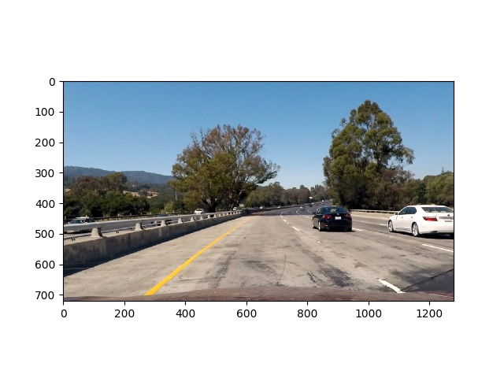
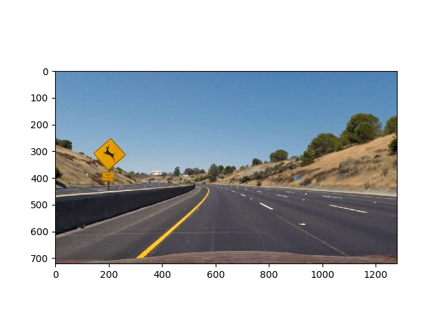

#### Construction of binary image

After some experiments, the combination of the following masks was choosen to construct thresholded binary image:

* Sobel filters in X and Y directions 
* R-channel from image converted to RGB space
* S-channel from image converted to HLS space

Here are some example of thresholded binary images:

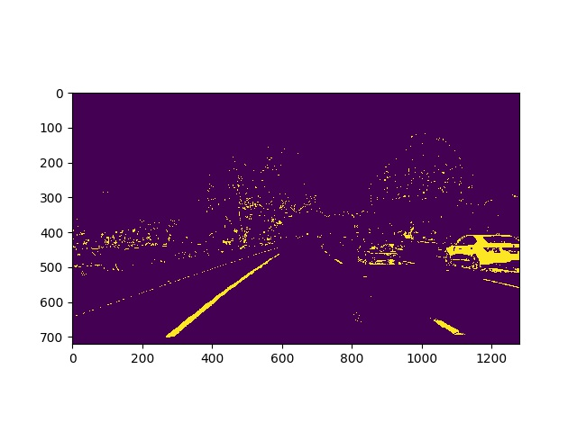
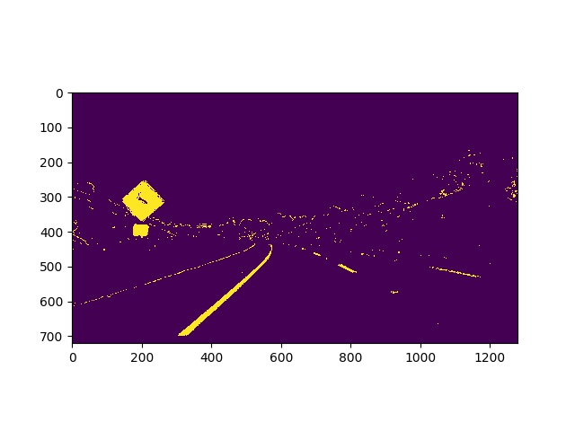

#### Perspective transform

Perspective transform is applied to rectify binary image ("birds-eye view"). After some experiments, the following source and destination points have been choosen and it was verified that lane lines appear parallel in a warped image:

| Source        | Destination   | 
|:--------------|:--------------| 
| 700, 450      | 620, 100      | 
| 1110, 660      | 620, 1180    |
| 190, 660     | 100, 1180      |
| 580, 450      | 100, 100      |

The perspective transform is perfomed by subsequently calling `getPerspectiveTransform()` and `warpPerspective()`. Some examples of warped images are here:

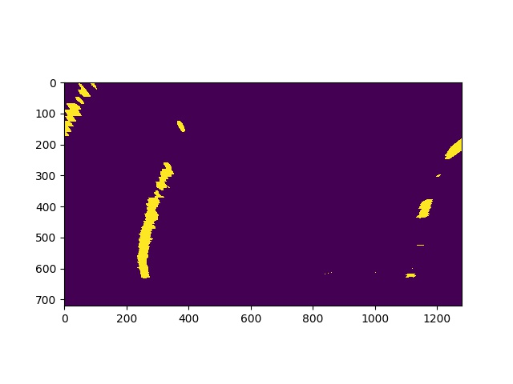
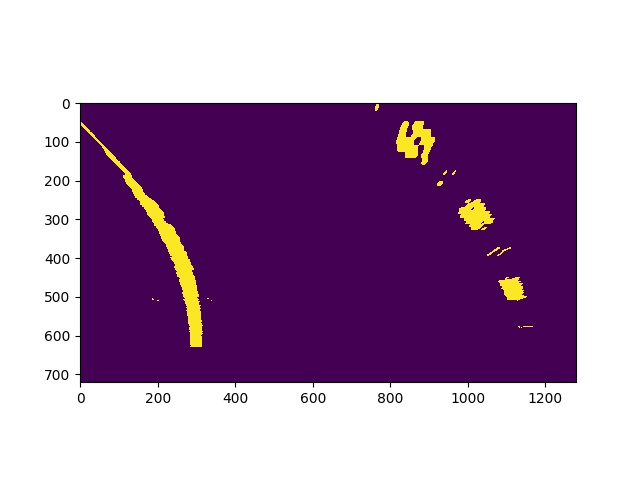
  

#### Lane-line pixels identification and polynomial fitting

Lane-line pixels and polynomial fitting are performed in `find_lanes_and_fit_polynomials()` and `find_lane_pixels()` functions. Lane-line pixels are identified using sliding windows technique:

1. Histogram of the bottom half of the image is calculated and peaks are found for left and right halves of the histogram.
2. Scanning of the image from bottom to top is performed and pixels to form lane lines are identified.

Found lane-line pixels are then fitted with 2nd order polynomials. Here are some example images:

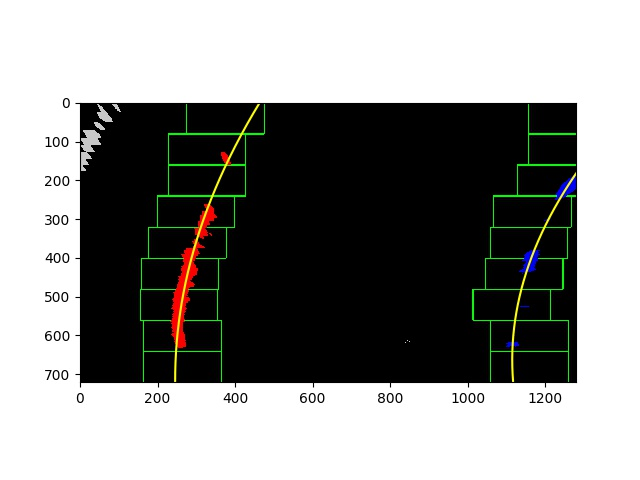
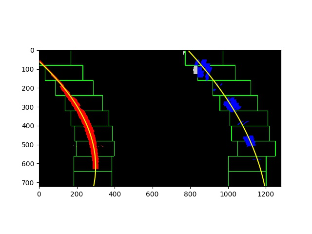
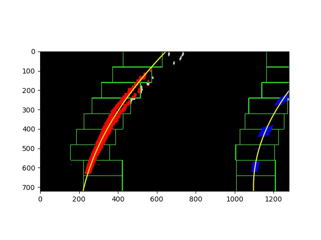

  

#### Lane curvatures and vehicle position calculations

Lane curvatures and vehicle position calculations are performed in `find_lanes_and_fit_polynomials()` and `measure_curvature_pixels()` functions.

Conversion from pixels to meters is performed and polynomial fitting is done in meters. These fits are then applied to to find lane curvatures.

Vehicle offset is calculated by substituting midpoint of detected road from center of the image and then converting to meters.

Here are the results for 3 images from the previous section:

* Left radius / right radius / offset : 1141.42699981 / 681.728414634 / -0.142696388245
* Left radius / right radius / offset : 502.189134665 / 964.244117874 / -0.349519435763
* Left radius / right radius / offset : 956.37563679 / 654.105433233 / -0.067165795375

#### Final result

Finallly, processed image is warped back to the original image space using perspective transform with an inverse matrix and merged with the original image. Here are some example images:

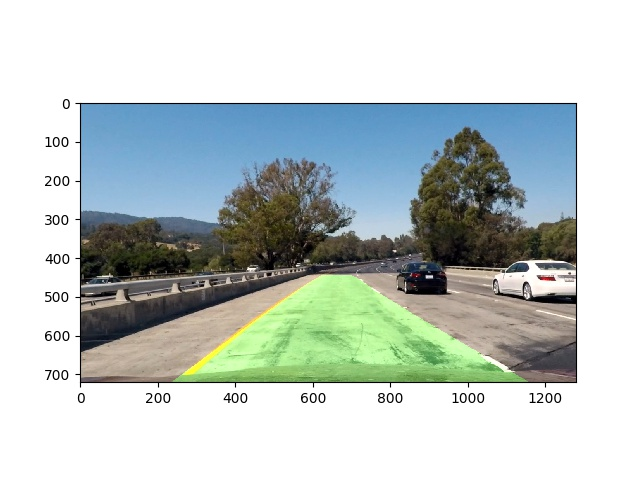
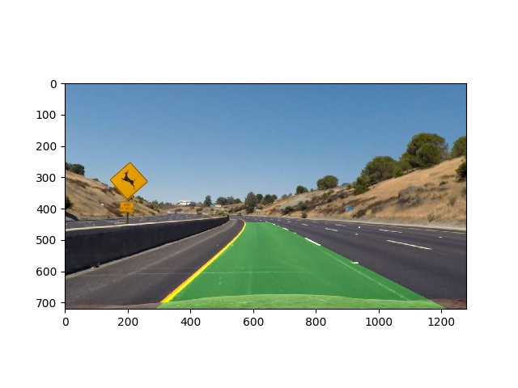
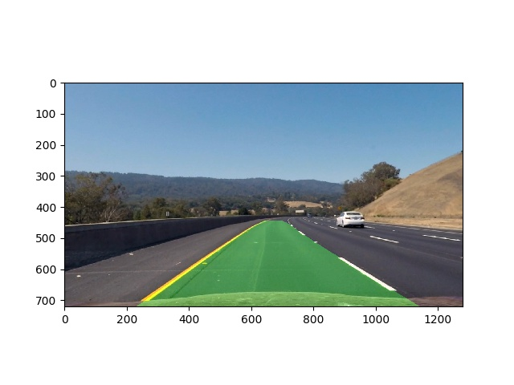

  

### 3. Lane lines detection pipeline (video)

Lane lines detection pipeline for video stream is implemented in `process_video_frame()` function and is similar to the pipelie for individual images described above. 

The example video with detected lane lines is provided by `project_video_with_lines.mp4`

### 4. Potential shortcomings and possible improvements with the current pipeline

The possible problem with the current pipeline could be lane lines detection in different or difficult light conditions. This probably could be solved by changing the way how thresholded binary mask is contructed. Probably this better should be done by using some 
some adaptive algorithms which choose appropriate color channels and other filters depeding on actual light conditions.
