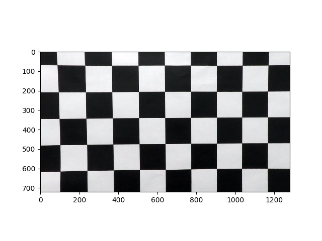
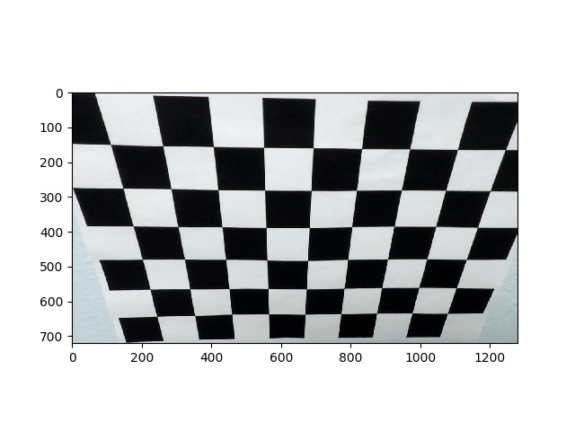
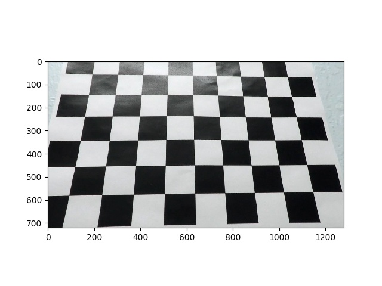
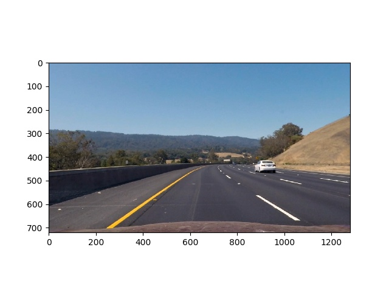
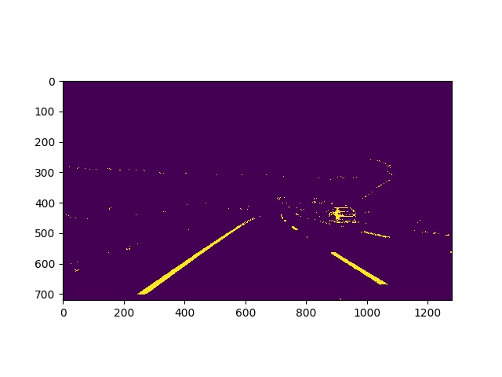
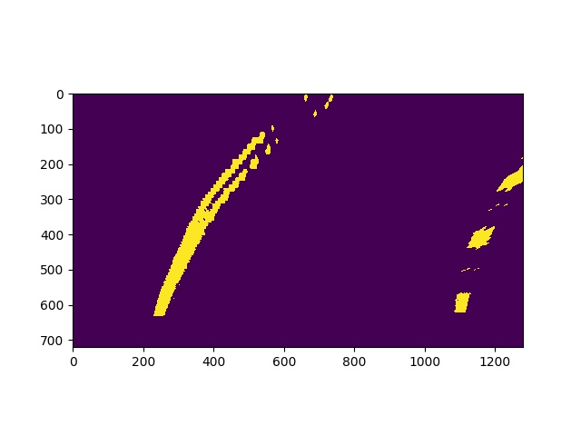

# **Finding Lane Lines on the Road with Advaned Techniques** 

---

**The goal of this project is to make a pipeline that finds lane lines on the road using some advanced techniques**

---

### Project files

The project includes the following files:

* `advanced_lane_lines.py` contains all the functions for lane lines detection pipeline
* `project_video_with_lanes.mp4` is a video with detected lane lines

### 1. Camera Calibration

Function `calibrate()` implements camera calibration. This should be done only once and the obtained results are used then by the pipeline. Here two arrays are constructed - object points in real world space and image points in image plane. Image points are found by calling `findChessboardCorners()` on provided calibration images. Object points are just equally distributed reference points (9x6 grid). Then `calibrateCamera()` is called to find correspionding mapping to be used later for distorion correction. Some examples of undistorted calibration images are:

### 2. Lane lines detection pipeline (single images)

The function `process_image()` contains implementation of the lane lines detection pipeline.

#### Distortion correction

An image is undistorted using results obtained from camera calibration step:

#### Construction of binary image

After some experiments, the combination of the following masks was choosen to construct thresholded binary image:

* Sobel filters in X and Y directions 
* R-channel from image converted to RGB space
* S-channel from image converted to HLS space

Here is an example of thresholded binary image:

#### 3. Perspective transform

Perspective transform is applied to rectify binary image ("birds-eye view"). After some experiments, the following source and destination points have been choosen and it was verified that lane lines appear parallel in a warped image:

| Source        | Destination   | 
|:--------------|:--------------| 
| 700, 450      | 620, 100      | 
| 1110, 660      | 620, 1180    |
| 190, 660     | 100, 1180      |
| 580, 450      | 100, 100      |

The perspective transform is perfomed by subsequently calling `getPerspectiveTransform()` and `warpPerspective()`. An example of a warped image is here:

#### 4. Describe how (and identify where in your code) you identified lane-line pixels and fit their positions with a polynomial?

Then I did some other stuff and fit my lane lines with a 2nd order polynomial kinda like this:

![alt text][image5]

#### 5. Describe how (and identify where in your code) you calculated the radius of curvature of the lane and the position of the vehicle with respect to center.

I did this in lines # through # in my code in `my_other_file.py`

#### 6. Provide an example image of your result plotted back down onto the road such that the lane area is identified clearly.

I implemented this step in lines # through # in my code in `yet_another_file.py` in the function `map_lane()`.  Here is an example of my result on a test image:

![alt text][image6]

---

### 2. Lane lines detection pipeline (video)

...

#### 1. Provide a link to your final video output.  Your pipeline should perform reasonably well on the entire project video (wobbly lines are ok but no catastrophic failures that would cause the car to drive off the road!).

Here's a [link to my video result](./project_video.mp4)

---

### Discussion

#### 1. Briefly discuss any problems / issues you faced in your implementation of this project.  Where will your pipeline likely fail?  What could you do to make it more robust?

Lighting conditions.

Here I'll talk about the approach I took, what techniques I used, what worked and why, where the pipeline might fail and how I might improve it if I were going to pursue this project further.  
