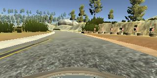
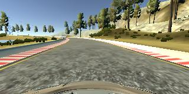
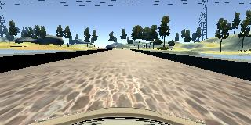
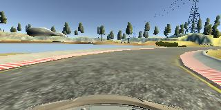
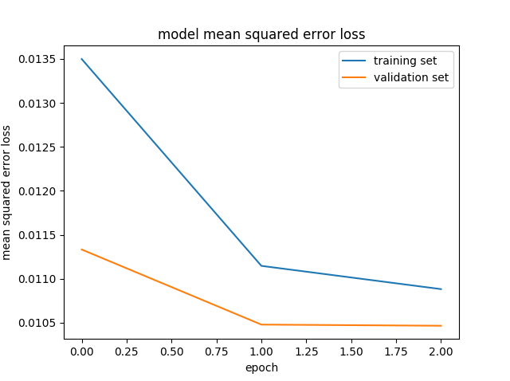

# **Behavioral Cloning** 

---

**The goal of this project is to design and train CNN to perform autonomous driving in a simulator**

---

### 1. Project files

The project includes the following files:

* `model.py` contains the script to create and train CNN
* `model.h5` contains a trained CNN
* `drive.py` for driving the car in autonomous mode using simulator
* `video.mp4` is a video of autonomous driving with a trained CNN

The `model.py` contains the code for training and saving the convolution neural network. The trained CNN is saved in model.h5.

Using Udacity simulator, the car can be driven autonomously around the track with a help of trained CNN by executing:
```sh
python drive.py model.h5
```

Video example of autonomous driving is provided by `video.mp4`.

### 2. Model Architecture and Training Strategy

#### Model Architecture

The initial network architecture was similar to LeNet-5. Different shapes of layers were evaluated and different data collection strategies were tried, but it was not possible to obtain a trained CNN which could perform successfully in the simulator, i.e. vehicle didn't stay on track.

After some investigation, the network proposed by Nvidia [arXiv:1604.07316v1](https://arxiv.org/abs/1604.07316v1) was implemented. The network consists of 5 convolution and 5 activation layers, followed by 3 fully connected layers. In addition, two dropout layers were added to help with possible overfitting problems. The network also contains 3 layers to crop, resize and normalize the data. This network was successfully trained and run in the simulator.

#### Data Collection Strategy

Data collection was performed by carefully driving around the track one lap forward and then one lap backward. After some experiments, it was found that 5 such steps are required (i.e. 5 laps forward and 5 laps backward). Only center camera images were used. Some examples of such images:







The total amount of images was 42162. The data was shuffled and splitted (80% for training, 20% for validation).

Due to substantial amount of data, generators for training and validation data sets are constructed and used.

#### Model Training

Adam optimizer is used, so the learning rate was not tuned manually.

Model was trained for 3 epochs. Here are training and validation losses:


The model was tested by running it through the simulator and ensuring that the vehicle could stay on the track. The recorded video is provided in video.mp4.
