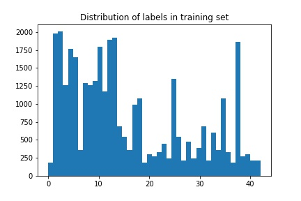
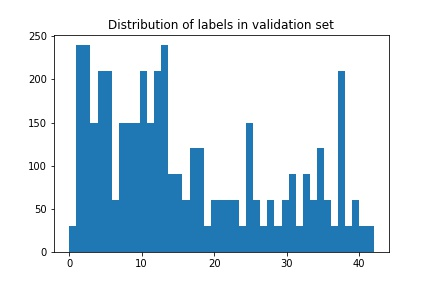
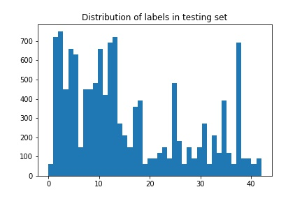
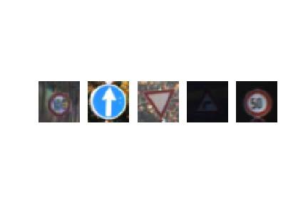
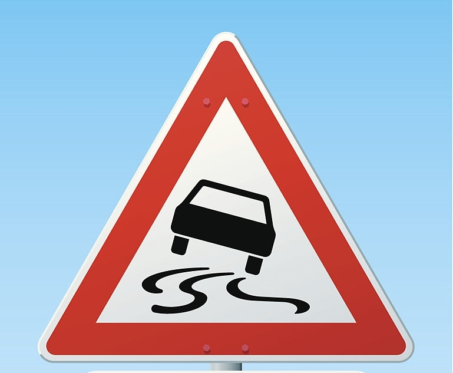
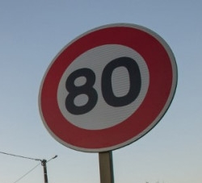
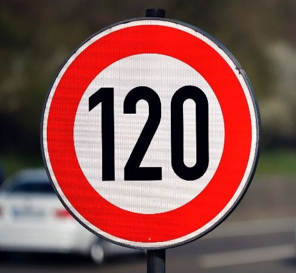

# **Traffic Sign Recognition** 

---

**The goal of this project is to design and apply traffic sign classifier using TensorFlow**

---

### 1. Data Set Summary & Exploration.

#### Basic Summary of the Data Set.

Summary statistics of the traffic signs data set:

* Number of training samples = 34799
* Number of validation samples = 4410
* Number of testing samples = 12630
* Image data shape = (32, 32, 3)
* Number of classes = 43

#### Eploratory visualization of the dataset.

Here are distributions of labels in training, validation and testing sets:





Some random image samples from training set:



### 2. Model Architecture Design and Testing.

#### Image Data Preprocessing.

Image data were normalized to zero mean and unit variance. This is important step to ensure that the problem is well conditioned and so to help with convergence of an optimizer.

#### CNN architecture.

The network consists of the following layers:

| Layer         		      |     Description	        					                 | 
|:----------------------|:----------------------------------------------| 
| Input               		| 32x32x3 normalized RGB image   						        	| 
| Convolution 5x5      	| 1x1 stride, valid padding, outputs 28x28x12  	|
| RELU	             				|	Activation layer                             	|
| Max pooling	         	| 2x2 stride,  outputs 14x14x12             				|
| Convolution 5x5      	| 1x1 stride, valid padding, outputs 10x10x24  	|
| RELU	             				|	Activation layer                             	|
| Max pooling	         	| 2x2 stride,  outputs 5x5x24               				|
| Fully connected	     	| Outputs 180                          									|
| RELU	             				|	Activation layer                             	|
| Dropout           				|	Regularization layer                         	|
| Fully connected	     	| Outputs 130                          									|
| RELU	             				|	Activation layer                             	|
| Dropout           				|	Regularization layer                         	|
| Fully connected	     	| Outputs 43                           									| 

#### CNN training and evaluation.

After some experimnets, the parameters to train CNN was choosen to be:

* Number of epochs = 10
* Batch size = 128
* Keep probabilty for dropout layers = 0.5
* AdamOptimizer, learning rate = 0.001

If trained longer than 10 epochs, validation loss starts to increase which indicates overfitting.

AdamOptimizer was choosen as it implements both momentum technique and adaptive learning rate and is considered to outperform classic SGD in most cases.

Results of training and evaluation are:

* Validation set accuracy = 0.959
* Test set accuracy = 0.944

#### Some notes about the choosen model architecture and hyperparameters.

The initial model architecture was equivalent to LeNet-5, except output layer was changed to predict 43 classes. Different values of hyperparameters were evaluated (batch size, number of epochs and learning rate) but it was not possible to attain desired validation set accuracy. This can be explained by the fact that LeNet-5 is relatively small CNN and it simply can not be trained to generalize accurate enough the traffic signs data set. Thus the model was substantially increased. The final model contains 2 convolution and 3 fully connected layers as LeNet-5, but all layers are larger. Besides, two dropout layers were added to help with possible overfitting problems.

### 3. Model Testing on New Images.

#### 5 random traffic signs from the web.

<p float="left">





</p>

All these images should be relatively easy to classify. "80 km/h" sign could be a little problematic as it is rotated a little bit.

#### CNN classification of new traffic signs images.

All images were correctly classified with surpsingly high accuracy.

Here is the top five softmax probabilities:

```python
TopKV2(values=array([[  9.99983311e-01,   1.65727470e-05,   3.61731658e-08,
          2.73640097e-08,   5.12993619e-13],
       [  9.79301810e-01,   1.75401308e-02,   2.49240967e-03,
          6.64512918e-04,   8.48542015e-07],
       [  1.00000000e+00,   8.41183656e-09,   3.37481372e-13,
          1.27688972e-14,   4.87660479e-16],
       [  9.99993443e-01,   3.22659889e-06,   1.57561703e-06,
          8.44999761e-07,   6.64627578e-07],
       [  9.59331214e-01,   4.06679101e-02,   4.04650450e-07,
          2.89243332e-07,   8.11519811e-08]], dtype=float32), indices=array([[23, 30, 19, 20, 28],
       [ 5, 10,  7,  3,  2],
       [ 8,  7,  5, 28,  4],
       [14, 17, 29, 13, 15],
       [25, 31, 30, 29, 21]]))
```

Here are the extracted classification probablities:

| Image			        | Classification probability  | 
|:------------------|:----------------------------| 
| Slippery road     | 0.99   		    							| 
| 80 km/h      			| 0.98       								  |
| 120 km/h  				| 1.00                        |
| Stop          		| 0.99                        |
| Road work    			| 0.96          							|

This gives model accuracy of 100% on this data set.
