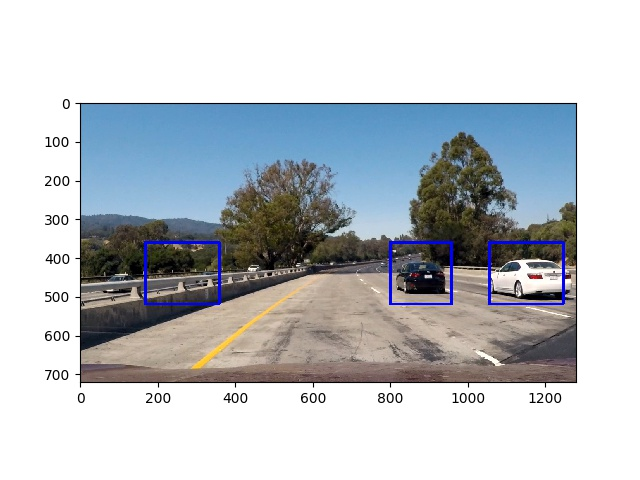
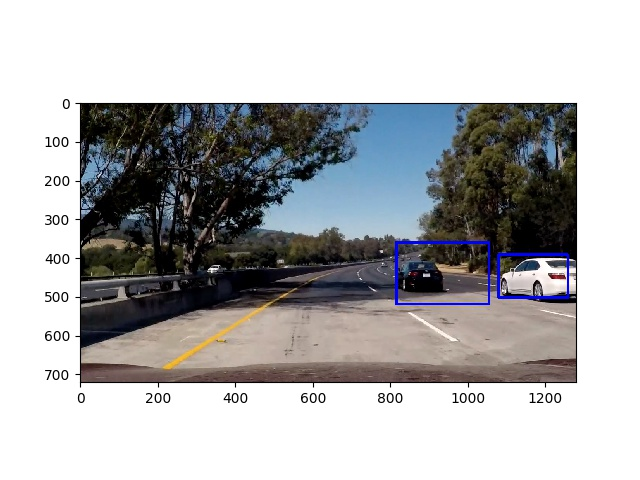

# **Vehicle Detection** 

---

**The goal of this project is to make a pipeline to detect vehicles in a video stream**

---

### 1. Project files

The project includes the following files:

* `svm_classifier.py` is a script to train SVM classifier
* `tracking.py` is a script to run a vehicle detection pipeline
* `common_functions.py` contains all the functions used in `svm_classifier.py` and `tracking.py`
* `project_video_with_tracking.mp4` is a video with detected vehicles

### 2. Feature extraction and trainign SVM classifier

The labeled data set for [vehicle](https://s3.amazonaws.com/udacity-sdc/Vehicle_Tracking/vehicles.zip) and [non-vehicle](https://s3.amazonaws.com/udacity-sdc/Vehicle_Tracking/non-vehicles.zip) examples was used. Some statistics about the data set:

* car images: 8792
* non-car images: 8968
* image shape: (64, 64, 3)

The data is read by `read_data()` function and then future extraction is performed by `extract_features()` function. `extract_features()` extracts features for each invidual image calling `extract_features_single()`. `extract_features_single()` extracts HOG features and also binned color and color histogram features if required. Only HOG features were used in this project (see some notes in the next section).

After feature extraction is done, SVM classifier is trained in `train_svm_classifier()` function. Here, the data set is shuffled and splitted (80% for training, 20% for validation) and normalized using `StandardScaler()`. Then training is performed and accuracy is checked. The obtained accuracy on validation set is :

* SVM accuracy: 0.98

### 3. Some notes on feature selection and HOG paramaters

After some experiments, the following parameters for HOG features extraction were choosen:

* color space: YCrCb
* orient: 11
* pix_per_cell: 8
* cell_per_block: 2

It's also possible to combine HOG features with binned color and color histogram features. Such feature vector was also evaluated, but in that case `pix_per_cell` was choosen to be `16` to prevent significant performance degradation of the the vehicle detection pipeline. However, the detection accuracy with such a vector was lower than with just HOG features extracted with `pix_per_cell = 8`.

### 4. Vehicle detection pipeline

The trained model is stored in a pickle file and then can be used in vehicle detection pipeline `tracking.py`. Here either `process_images()` and `process_video()` are called to process either test images or test video. Both however call `process_single_image()` where the main work is done.

#### Sliding Window Search

`process_single_image()` calls `find_cars()` to detect vehicles on an image. Here HOG, binned color and color histogram features are extracted and normalized for an individual image, and then scanning is performed to detect possible vehicle locations using pre-trained model. Search window is of the same size, but vehicles can be of different sizes (depedning how far they are), so `find_cars()` is called few times and image is resized inside before scanning for vehicles. After some experiments, the following scales have been choosen:

* 0.75 for (0.5 * *image_heigh*) to (0.7 * *image_height*)
* 1.0, 1.5, 2.0, 2.5, 3.0, 3.5 for (0.5 * *image_height*) to (1.0 * *image_height*)

After calling `find_cars()` all detected vehicle locations (bounding boxes) are stored in one single list.

#### Multiple Detections & False Positives

To construct final bounding boxes for vehicles locations and filter out some false positives, the following steps are performed:
1. First `add_heat()` function is called which adds all detected bounding boxes to a heat map.
2. Then `apply_threshold()` function is called which filter out false positives (i.e. only regions where substantial amount of detected bounding boxes are overlapped are left intact and all others are filtered out).
3. Finally `label()` function is called which attach labels to each detected region.

After that `draw_labeled_bboxes()` is called which draws bounding boxes for detected regions. Some results of this pipiline for test images are here:

#### Some notes about pipeline for video processing

For video processing additional step can be performed. All detected bounding boxes can be stored in a `history` object in a buffer with a specified size. This buffer can be updated for each frame, and heat map can be produced taking into account content of this buffer. This potentially could help with vehicle tracking and filtering of false positives. However, this needs some additional parameter tuning and so was not used for production of the test video.

### 5. Potential shortcomings and possible improvements with the current pipeline

The implemented vehicle detection pipeline works, but its performance is not always satisfactory. This is probably mainly due to relatively small data set used to train classifier. Another possible problem with the current pipeline could be vehicle detection in different light conditions (i.e. night / day). This probably could be improved by playing with color space or by using different pre-trained classifiers for different light conditions and choose the appropriate one.
